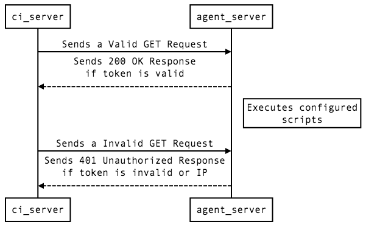

# Deployment Agent

[](https://travis-ci.org/dtchanpura/deployment-agent)

## Introduction

Deployment Agent is a program which allows users to run a script on remote server
on webhook call. Program commands allow one to initialize configuration, add a
new project, list added projects, etc. It also allows to start a HTTP server
(listener) which will listen indefinitely (until exception occurs) for a webhook
from a CI server or GitHub/Bitbucket hooks.

## Getting started

* Download the latest release based on your machine architecture and operating
system
* Extract and Copy executable file named `deployment-agent` in PATH so it can executed,
e.g. in `/usr/local/bin` or `/usr/bin`
* Run `deployment-agent init` to initialize the configuration file stored in
`~/.deployment-agent.yaml`
* Add a project by `deployment-agent add --name yourproject --ip-cidr 192.168.1.0/24`
  - Make a note of this Hash and UUID which will be used to call the webhook
  from other servers
* List projects by `deployment-agent list`

## Example



Example Configuration Structure

```yaml
serve:
    host: 0.0.0.0
    port: 8000
projects:
  - name: test-project
    uuid: test-uuid
    work_dir: /home/user
    pre_hook: /tmp/download-code.sh
    pre_hook_args:
      - s3://bucket/file
      - /tmp/codedir/download
    post_hook: /bin/sh
    post_hook_args:
      - systemctl
      - "--user"
      - restart
      - myservice.service
    tokens:
      - token: SOMERANDOMCHARS
        whitelistnet: 192.168.1.0/24
      - token: SOMERANDOMCHARS2
        whitelistnet: 192.168.2.0/24
```

## Commands

### `add`

This command is for adding a new project. Following are some command arguments
which can be used to add information about project.

* --name: for specifying name of the project
* --work-dir: for specifying working directory of the project (Optional)
* --ip-cidr: for whitelisting the given network only.
  - this option can be used multiple times and it generates different hashes
  for each of this network
* --pre-hook, --post-hook, --error-hook: these are the executable files which
can be provided while adding the project. (Optional)
  - Prehook is ran just after the webhook is called. It can be a script to
  download the code
  - Posthook is ran after prehook and can be used to restart some services if
  needed.
  - Errorhook is ran in case of error from any of the previous hooks executed.
  - In case of more arguments needed to be provided for the given hooks it can
  be added in pre_hook_args, post_hook_args and error_hook_args options in
  configuration file

After adding a configuration there will be an output containing two things for
given IP CIDR Network.

1. UUID: for given configuration
2. Hash: for each IP CIDR for given configuration

> Note: Following is the sample output
```
UUID for this project is: 1af4316b-4de3-4ec5-8027-6fb02cb018d1
Hash to be used for 192.168.1.0/24: Cs03U__-kHs3B_0uqZ05_GLIvXrrP7wUbfq1tJhS8z-0
```


### `list`

This command is for listing down the projects available in configuration file,
output looks as below.

```
Following are the projects with their UUIDs
 1. "aquatic_bike", UUID: d6e0c569-0359-4f6c-bdeb-21ac53f42b00
```


### `serve`

This command starts the HTTP server (listener) for listening to webhook from CI
server. It can optionally take parameters as follows

* `--host`: for specifying which host/ip it should listen to
* `--port`: for specifying which port it should listen to

The server which starts listening is currently having only one route `/reload`
which can be used for running deployment scripts. Pattern is `http://hostname:8000/reload/<uuid>/<hash>`

Following is the sample cURL for sending request.

```sh
# URL is formed by http://hostname:8000/reload/<uuid>/<hash>
curl -i \
  "http://deployment.example.com/reload/1af4316b-4de3-4ec5-8027-6fb02cb018d1/Cs03U__-kHs3B_0uqZ05_GLIvXrrP7wUbfq1tJhS8z-0"
```

### `version`

This is for checking version and build date of program


> Note: Most of the code for [build.go]() has been copied from [syncthing/syncthing](https://github.com/syncthing/syncthing)
